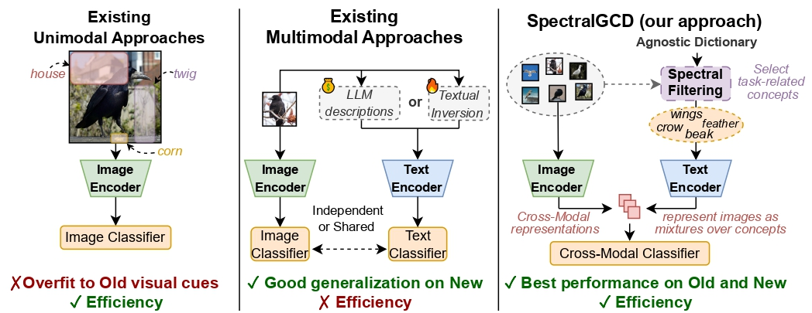

# SpectralGCD (ICLR 2026)
### Spectral Concept Selection and Cross-modal Representation Learning for Generalized Category Discovery

[](https://arxiv.org/abs/2602.17395)
[](https://openreview.net/forum?id=PyfV9tFmdR)
[](https://github.com/miccunifi/SpectralGCD)

This is the **official repository** of the [**ICLR 2026 paper**](https://openreview.net/forum?id=PyfV9tFmdR)
"*SpectralGCD: Spectral Concept Selection and Cross-modal Representation Learning for Generalized Category Discovery*"
by Lorenzo Caselli, Marco Mistretta, Simone Magistri, Andrew D. Bagdanov.

## Abstract

Generalized Category Discovery (GCD) aims to identify novel categories in unlabeled data while leveraging a small labeled subset of known classes. Training a parametric classifier solely on image features often leads to overfitting to old classes, and recent multimodal approaches improve performance by incorporating textual information. However, they treat modalities independently and incur high computational cost. We propose SpectralGCD, an efficient and effective multimodal approach to GCD that uses CLIP cross-modal image-concept similarities as a unified cross-modal representation. Each image is expressed as a mixture over semantic concepts from a large task-agnostic dictionary, which anchors learning to explicit semantics and reduces reliance on spurious visual cues. To maintain the semantic quality of representations learned by an efficient student, we introduce Spectral Filtering which exploits a cross-modal covariance matrix over the softmaxed similarities measured by a strong teacher model to automatically retain only relevant concepts from the dictionary. Forward and reverse knowledge distillation from the same teacher ensures that the cross-modal representations of the student remain both semantically sufficient and well-aligned. Across six benchmarks, SpectralGCD delivers accuracy comparable to or significantly superior to state-of-the-art methods at a fraction of the computational cost.



Check our [demo](https://github.com/miccunifi/SpectralGCD?tab=readme-ov-file#how-to-use-spectral-filtering) on how to use Spectral Filtering on any dataset.

## Citation
```bibtex
@inproceedings{caselli2026spectralgcd,
    author={Lorenzo Caselli and Marco Mistretta and Simone Magistri and Andrew D. Bagdanov},
    title={Spectral{GCD}: Spectral Concept Selection and Cross-modal Representation Learning for Generalized Category Discovery},
    booktitle={The Fourteenth International Conference on Learning Representations},
    year={2026},
    url={https://openreview.net/forum?id=PyfV9tFmdR}
}
```

<details>
<summary><h2>Installation</h2></summary>

The codebase has been tested with **Python 3.9** and **PyTorch 2.6.0** with **CUDA 12.4**.

```bash
conda env create -f environment.yml
conda activate spectralgcd
```
 
</details>

<details>
<summary><h2>Datasets</h2></summary>

We evaluate on the following standard GCD benchmarks:

| Dataset | Total Classes | Known | Novel | Type |
|---------|:---:|:---:|:---:|------|
| CIFAR-10 | 10 | 5 | 5 | Generic |
| CIFAR-100 | 100 | 80 | 20 | Generic |
| ImageNet-100 | 100 | 50 | 50 | Generic |
| CUB-200 | 200 | 100 | 100 | Fine-grained |
| Stanford Cars | 196 | 98 | 98 | Fine-grained |
| FGVC Aircraft | 100 | 50 | 50 | Fine-grained |

**Download links:**
- [CIFAR-10/100](https://pytorch.org/vision/stable/datasets.html) — auto-downloaded by torchvision
- [ImageNet-100](https://image-net.org/download.php)
- [CUB-200 / Stanford Cars / FGVC Aircraft](https://github.com/sgvaze/osr_closed_set_all_you_need#ssb) — via the Semantic Shift Benchmark splits

After downloading, set the dataset paths in [config.py](config.py):

```python
cifar_10_root = 'path_to_dataset/cifar10'
cifar_100_root = 'path_to_dataset/cifar100'
cub_root = 'path_to_dataset/cub'
aircraft_root = 'path_to_dataset/fgvc_aircraft'
car_root = 'path_to_dataset/stanford_cars'
imagenet_root = 'path_to_dataset/imagenet'
```

</details>

<details>
<summary><h2>Reproducing the Experiments</h2></summary>

The easiest way to run it is via the provided scripts, which handle all datasets and seeds automatically.

### Quick start — all datasets

Set the paths at the top of the file, then run:

```bash
bash scripts/train_all_datasets.sh
```

This iterates over all six datasets (`cub`, `scars`, `aircraft`, `cifar10`, `cifar100`, `imagenet_100`), runs steps 1–3 for each, and repeats training for 3 seeds.

### Quick start — single dataset

```bash
bash scripts/train_single_dataset.sh
```

Set `DATASET_NAME` at the top of the file to select the dataset (default: `cub`).

---

The steps can also be run individually as described below.

---

### Step 1 — Save class name splits

Generates `old_class_names.csv` and `new_class_names.csv` under `dataset_class_names/{dataset_name}/`, encoding which classes are known (old) and which are novel.

```bash
python -m utils.save_old_class_names \
    --dataset_name "cub" \
    --use_ssb_splits
```

This must be run once per dataset before spectral filtering.

---

### Step 2 — Spectral Filtering

Filters the concept dictionary down to a compact, discriminative subset relevant to the dataset. The output is a CSV file consumed by the training script.

```bash
python spectral_filtering.py \
    --dataset_name "cub" \
    --batch_size 128 \
    --num_workers 8 \
    --use_ssb_splits \
    --use_torch_impl \
    --thresholding_eig 0.95 \
    --thresholding_concepts 0.99 \
    --cuda_dev 0 \
    --path_to_filtered_concepts /path/to/filtered_concepts \
    --path_to_dictionary dictionaries/textgcd_tags_dictionary.csv \
    --exp_root /path/to/exp_root \
    --exp_id "cub_spectral_filtering"
```

The output file will be saved as `{path_to_filtered_concepts}/{dataset_name}_concepts.csv`.

**Key parameters:**

| Parameter | Default | Description |
|-----------|---------|-------------|
| `--thresholding_eig` | 0.99 | Variance threshold for eigenvalue selection (β_e) |
| `--thresholding_concepts` | 0.99 | Variance threshold for concept filtering (β_c) |
| `--use_torch_impl` | False | Use PyTorch GPU-accelerated eigendecomposition (recommended) |
| `--path_to_dictionary` | — | Path to concept dictionary CSV (see [available dictionaries](#concept-dictionaries)) |

#### Concept dictionaries

Three pre-built dictionaries are provided under `dictionaries/`:

| File | Concepts | Source |
|------|---------|--------|
| `textgcd_tags_dictionary.csv` | — | TextGCD tags (default) |
| `openimages_dictionary.csv` | — | Open Images labels |

---

### Step 3 — Training

```bash
python spectralgcd.py \
    --dataset_name "cub" \
    --batch_size 128 \
    --epochs 200 \
    --num_workers 8 \
    --use_ssb_splits \
    --sup_weight 0.35 \
    --weight_decay 5e-5 \
    --lr 0.1 \
    --lr_backbone 0.005 \
    --warmup_teacher_temp 0.07 \
    --teacher_temp 0.04 \
    --warmup_teacher_temp_epochs 30 \
    --memax_weight 2 \
    --seed 0 \
    --cuda_dev 0 \
    --path_to_filtered_concepts /path/to/filtered_concepts/cub_concepts.csv \
    --path_to_saved_cross_modal_representations /path/to/saved_representations \
    --exp_root /path/to/exp_root \
    --exp_id "cub_spectralgcd"
```

**Key hyperparameters:**

| Parameter | Default | Description |
|-----------|---------|-------------|
| `--lr` | 0.1 | Learning rate for the projection head |
| `--lr_backbone` | 0.005 | Learning rate for the CLIP backbone |
| `--sup_weight` | 0.35 | Weight balancing supervised vs. unsupervised loss |
| `--memax_weight` | 2 | Mean entropy maximization weight (dataset-specific) |
| `--teacher_temp` | 0.04 | GCD head temperature after warmup |
| `--warmup_teacher_temp` | 0.07 | Initial GCD head temperature |
| `--path_to_saved_cross_modal_representations` | `''` | Directory to cache teacher cross-modal features (set to `''` to disable) |

**Weights & Biases logging** is disabled by default. To enable it, add:

```bash
--use_wandb \
--w_key_path /path/to/wandb_key.txt \
--project_name "spectralgcd" \
--group_name "my_group" \
--experiment_name "cub_run"
```

</details>


<details open>
<summary><h2>How To Use Spectral Filtering</h2></summary>
If you want to use Spectral Filtering on some external/proprietary data, inside 
[`spectral_filtering_demo.ipynb`](spectral_filtering_demo.ipynb) you can find a  self-contained implementation that runs the full Spectral Filtering pipeline on any dataset you want.
It might be useful even for inspecting which concepts from a large dictionary are retained for a given dataset.

To run the demo, please set the following variables in the **Configuration** cell before proceeding:

| Variable | Description |
|----------|-------------|
| `PROJECT_ROOT` | Absolute path to the repository root |
| `AIRCRAFT_ROOT` | Path to the FGVC-Aircraft dataset (swap for any other dataset loader) |
| `PATH_TO_DICTIONARY` | Concept dictionary CSV (default: `dictionaries/textgcd_tags_dictionary.csv`) |
| `PATH_TO_OUTPUT` | Where to save the filtered concept CSV |
| `CLIP_MODEL` | HuggingFace Hub ID of the teacher CLIP model |


</details>


## Acknowledgements

Our codebase builds upon [GET](https://github.com/enguangW/GET) and [SimGCD](https://github.com/CVMI-Lab/SimGCD). We thank the authors for their excellent work.

## License

This project is licensed under the MIT License - see the [LICENSE](LICENSE) file for details. 

## Contact

If you have further questions or discussions, feel free to reach out:

Lorenzo Caselli (lorenzo.caselli@unifi.it - caselli.lorenzo1@gmail.com)
